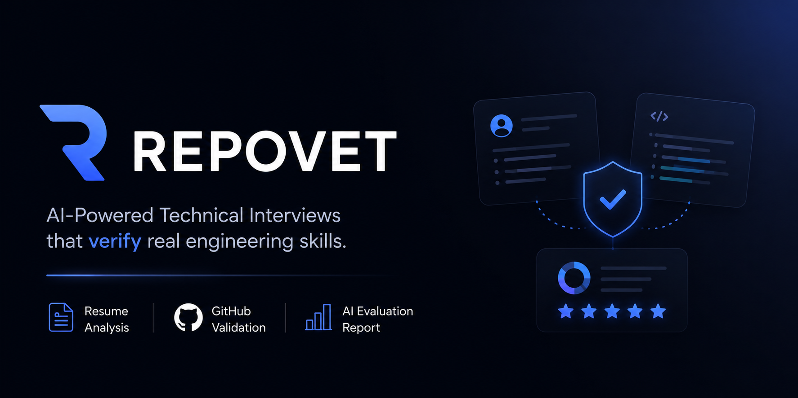
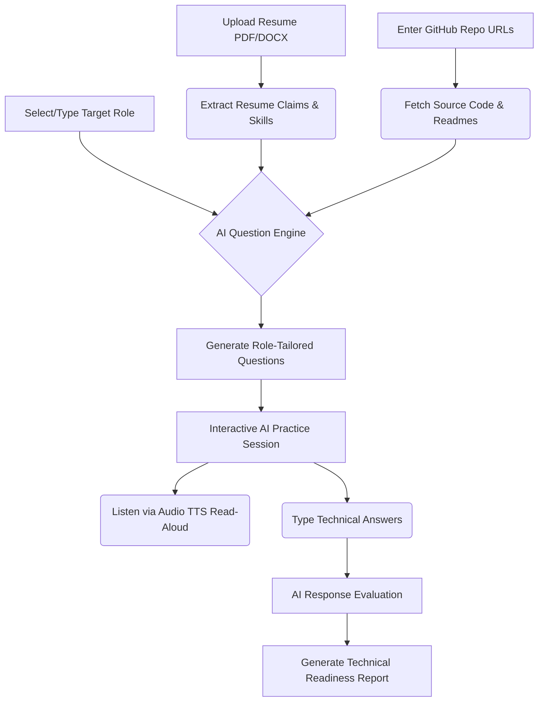

# ◈ Repovet — AI-Powered Technical Interview Prep Platform

  

  ### **"Ace your technical interview. Turn your projects into practice."**

  
  
  
  

  [Features](#-key-features) • [How It Works](#-how-it-works)

---

> [!NOTE]
> **Built by Team Cadence:** Repovet bridges the gap between generic LeetCode grinding and real-world technical interviews. By analyzing a candidate's **resume claims** alongside their **actual GitHub repository source code**, Repovet generates realistic, role-tailored interview practice and feedback.

---

## 💡 The Problem vs. The Repovet Solution

| Traditional Tech Interview Prep | ◈ Repovet Project-Grounded Practice |
| :--- | :--- |
| **Generic LeetCode Grinding:** Hundreds of hours spent solving abstract puzzles unrelated to real work. | **Grounded in Your Actual Code:** Practice explaining and defending the custom hooks, API endpoints, and schemas you built. |
| **One-Size-Fits-All Questions:** Irrelevant questions that ignore your target position. | **Role-Tailored Blueprints:** Customized question depth for Cybersecurity, DevOps, Full-Stack, AI, or Student roles. |
| **Silent Text Questions:** Static text boxes with no audio context. | **Audio Read-Aloud (TTS):** Click the speaker button to hear questions spoken aloud, simulating a real interview room. |
| **No Actionable Roadmap:** Binary pass/fail results with no guidance on how to improve. | **Detailed Feedback Report:** Comprehensive readiness score, architectural strengths, and targeted study roadmap. |

---

## 🛠️ How It Works

1. **Resume & GitHub Fusion:** Upload your resume (PDF/DOCX) and link public GitHub repositories. Repovet parses your listed experience and inspects actual source code, commit history, and framework setups.
2. **Role Blueprinting:** Choose or type any target role (e.g. *Cybersecurity Engineer*, *DevOps*, *Full-Stack*, or *Student*).
3. **Session Builder:** An animated loading screen provides real-time progress as AI constructs a personalized 3–12 question interview roadmap.
4. **Interactive Practice Chat:** Experience deep-dive technical questions grounded in your project code. Listen to questions via Audio TTS read-aloud and submit detailed technical answers.
5. **Readiness Feedback Report:** Receive an overall readiness score (e.g. 87/100), verified technical strengths, identified skill gaps, and actionable prep recommendations.

---

## ✨ Key Features

- 🎯 **Searchable Target Role Combobox:** Select from expanded industry roles or type any custom position (e.g. *"Student"* or *"Security Researcher"*) with real-time filtering and custom role validation.
- 💻 **Deep Codebase Integration:** Sequential, batched GitHub API fetching inspects actual project source code, file structures, custom hooks, and documentation.
- 🔊 **Audio Read-Aloud (Text-to-Speech):** Click the speaker button during practice sessions to hear questions spoken aloud to simulate a real audio interview.
- ⏳ **Real-Time Session Builder:** Dedicated loading screen with glowing spinner and animated pulse indicators for parsing skills, fetching code, and generating questions.
- 📊 **Comprehensive Evaluation Report:** Highlights architectural strengths, identified skill gaps, placement readiness score, and targeted study tips.
- 🔄 **Multi-Key Rotation & Failover:** Automatic key scanning switches seamlessly between API keys upon hitting rate limits for 100% uptime.
- 🛡️ **Enterprise Security & Reliability:** XML-delimited prompt injection sandboxing, Express API rate-limiting (100 req / 5 min), and real-time Discord Webhook logging alerts.
- 🎨 **Modern Glassmorphic UI:** Built with dark mode aesthetics, hero tagline typing effect, centered gradient fading line, and memoized voice scoring.

---

  **Made with ❤️ by Team Cadence**

