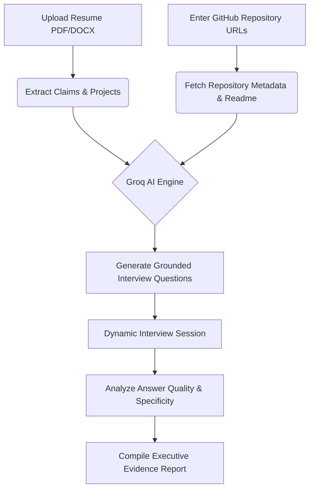

# ◈ Repovet

**"Evidence over guesswork."**  
Repovet turns a candidate's resume and public GitHub repositories into a tailored, defensive technical interview and an evidence-backed hiring report. Built for technical recruiters and hiring managers who want to cut through resume inflation and verify actual engineering depth.

---

## 💡 The Problem
In technical hiring, resumes are often padded with buzzwords, frameworks, and databases that the candidate may have barely touched. On the other side, hiring managers spend hours conducting standard whiteboard interviews or reviewing complex repositories manually. 

**Repovet solves this.** It parses the candidate's resume, cross-references it with their actual GitHub code repositories, identifies verification gaps, conducts a tailored technical interview, and delivers a clean verdict.

---

## 🛠️ How It Works



1. **Upload & Parse:** The candidate uploads their resume (PDF/DOCX) and inputs their public GitHub repository link(s).
2. **Ground & Align:** Repovet parses resume claims and fetches public metadata, languages, and readmes from the provided GitHub repositories.
3. **Tailored Interview:** An LLM-powered engine (Llama-3.3-70b via Groq) generates 3–12 customized questions testing the specific overlaps (or gaps) between claims and repositories.
4. **Answer Validation:** The candidate answers questions in real-time, which are analyzed for specificity, technical substance, and code alignment.
5. **Verdict & Next Steps:** An executive report details verified strengths, evidence gaps, a placement recommendation, and actionable growth tips for the candidate.

---

## ✨ Key Features
* **Resume Text Extraction:** In-memory extraction of PDF and DOCX resume content.
* **Multi-Repo Analysis:** Grounding queries against multiple repository structures, readmes, and languages simultaneously.
* **Dynamic Interview Engine:** Real-time conversational interview interface powered by state-of-the-art Llama 3.3 LLMs.
* **Persistent Sessions & Navigation:** Built with React Router for routing (with pages for Setup, Interview, and Reports) and local session preservation to survive browser refreshes.
* **Evidence Reports:** Clear, objective summaries highlighting verified strengths, gaps, "undefended" projects, and score breakdowns.
* **Local Session History:** Reopen, review, or delete past evaluation reports directly from the landing dashboard.

---

## 🚀 Tech Stack
* **Frontend:** React 18, Vite, React Router DOM, TailwindCSS
* **Backend:** Node.js, Express, Mongoose (MongoDB)
* **AI & Integration:** Groq SDK (Llama-3.3-70b-versatile), GitHub REST API

---

## 💻 Local Setup & Installation

### Prerequisites
* **Node.js** v20+
* **MongoDB** (local connection or MongoDB Atlas URI)
* **Groq API Key** (Get one at [console.groq.com](https://console.groq.com/))
* **GitHub Token** (Classic or Fine-grained Personal Access Token to increase GitHub API rate limits)

### Setup Instructions

1. **Clone the repository:**
   ```bash
   git clone https://github.com/Coreoflore/Hackathon-Test.git
   cd Hackathon-Test
   ```

2. **Initialize Environment variables:**
   ```bash
   # Copy environment templates
   cp backend/.env.example backend/.env
   cp frontend/.env.example frontend/.env
   ```
   Open `backend/.env` and fill in your secrets (`MONGODB_URI`, `GROQ_API_KEY`, and `GITHUB_TOKEN`).

3. **Install Dependencies:**
   Install packages across both the frontend and backend project workspaces:
   ```bash
   # Install root and backend dependencies
   npm install
   cd backend
   npm install
   
   # Install frontend dependencies
   cd ../frontend
   npm install
   ```

4. **Run the Application:**
   Open two terminal windows to run the API server and frontend client concurrently:

   * **Terminal 1: Start Backend API**
     ```bash
     cd backend
     npm run dev
     ```
     *Runs on `http://localhost:5000`*

   * **Terminal 2: Start Frontend UI**
     ```bash
     cd frontend
     npm run dev
     ```
     *Runs on `http://localhost:5173` (Vite dev server proxies `/api` calls to port `5000` automatically)*

---

## 🧪 Running Tests
Repovet includes a test suite verifying answer grading, resume validating, and prompt-construction integrity:

```bash
cd backend
npm test
```

---

## ⚙️ Environment Variables

### Backend (`backend/.env`)

| Variable | Purpose | Default / Example |
| :--- | :--- | :--- |
| `PORT` | Local Express API port. | `5000` |
| `MONGODB_URI` | Connection URI for the session database. | `mongodb://localhost:27017/repovet` |
| `GROQ_API_KEY` | Groq API access token. | *(Required)* |
| `GROQ_MODEL` | LLM model used for candidate evaluations. | `llama-3.3-70b-versatile` |
| `GITHUB_TOKEN` | Auth token for inspecting GitHub metadata. | *(Highly Recommended)* |
| `QUESTION_COUNT` | Default interview questions generated (3-12 range). | `6` |
| `MONGODB_DNS_SERVERS` | Manual DNS overrides for MongoDB Atlas connection issues. | `1.1.1.1,8.8.8.8` |
